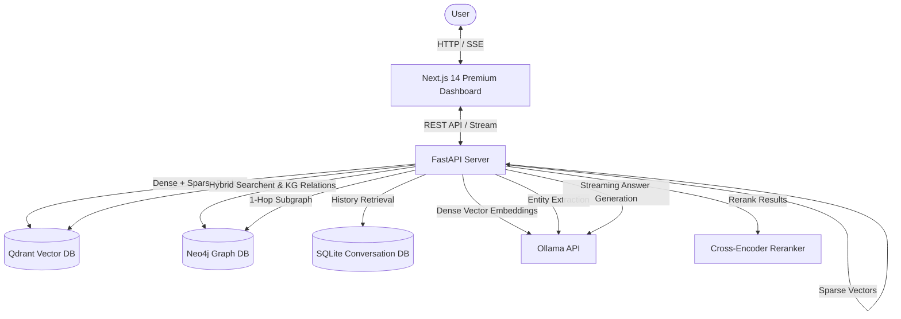

# I.N.A.Y.A.T. — Intelligent Neural Architecture for Yielding Agentic Thinking

A state-of-the-art, fully local AI Knowledge Intelligence System showcasing **Graph RAG**, **Hybrid Semantic Search**, **CPU-only Reranking**, **Persistent Memory**, and an **Interactive Knowledge Graph**. Optimized to run entirely offline on consumer-grade hardware (such as an NVIDIA RTX 3050 4GB laptop).

Developed as an MCA Final Year Major Project, featuring a stunning **2026-grade premium UI/UX dashboard** with real-time SSE token streaming, interactive Three.js node networks, and advanced document visualization.

---

## 🎨 Premium Visual Tour (V2 Dashboard)

### Home Page & Hero Section
* **Interactive Neural Mesh**: Three.js (React Three Fiber) background rendering a battery-friendly, 45 FPS-capped network constellation. Constellation nodes dynamically drift, react to mouse movements, and pulse color waves.
* **Brain Orbits**: The core logo features animated orbital nodes and gradient borders pulsing softly to draw the eye.
* **Glassmorphism Quick Actions**: Interactive glass cards styled with HSL neural colors, glowing outlines, hover scale-up transforms, and arrow animations.

### System Health Dashboard
* **Network Topology Indicators**: Tracks real-time REST API connections to Qdrant, Neo4j, Ollama, and local models. Replaces flat dot status indicators with glowing, stroke-dashed rotating SVG rings. Faint SVG topology paths connect the services to visually represent the data pipelines.

### Redesigned Documents Explorer
* **ChatGPT/Claude-style Layout**: A modern side-by-side workspace:
  * **Left Sidebar**: Unified list of uploaded documents (PDF, DOCX, TXT) with custom file-type color borders, ingestion date, file sizes, and chunk/relation counts. Includes quick-delete buttons.
  * **Workspace Viewport**: Renders selected document metadata, a scrollable text chunk viewer, and an interactive document-level knowledge graph.
  * **Multi-Step Upload Zone**: Drag-and-drop zone featuring floating icons, interactive dashed borders, and a simulated loading progress bar (`Text extraction` → `Neural Embedding` → `KG Compilation`).

### Ask & Chat Experience
* **Radial Mesh Gradients**: Deep ambient textures set the canvas for the chat layout.
* **Avatars & Wave Loading**: User and agent messages feature custom status circles, glowing left borders for assistant responses, and a wave-like typing loading indicator when processing.
* **Citations & Graph Viewer**: Interactive reference badges (coded by relevance: gold for hot/high score, cyan for medium) that dynamically highlight matching document chunks. A full 2D force-directed canvas generates matching 1-hop Neo4j subgraphs in real-time.

---

## 🚀 Technology Stack

| Layer | Technologies |
|---|---|
| **Frontend** | Next.js 14, React, Tailwind CSS, Shadcn UI, Framer Motion, Three.js (React Three Fiber), react-force-graph-2d |
| **Backend** | Python 3.11, FastAPI, Uvicorn, aiosqlite (SQLite), PyPDF2, python-docx, sentence-transformers, python-magic |
| **Databases** | Qdrant (Vector Database), Neo4j 5 (Knowledge Graph Database), SQLite (Conversation Memory) |
| **Local LLM Engine** | Ollama (`qwen3:4b` for generation, `nomic-embed-text:v1.5` for embeddings) |
| **Rerank Engine** | `cross-encoder/ms-marco-MiniLM-L-6-v2` (Runs on CPU) |

---

## 📐 System Architecture & Data Flow



---

## 🛠️ Offline Hardware Constraints & Safeguards

The architecture is carefully tuned to operate under **strict VRAM limits (4GB)** without throwing Out-of-Memory (OOM) exceptions:

1. **Forced CPU Embeddings**: The embedding model `nomic-embed-text:v1.5` runs strictly on the CPU (`"options": {"num_gpu": 0}`), preventing model-swapping thrashing on the GPU.
2. **Quantized KV Cache**: Ollama KV Cache is set to quantized 8-bit `q8_0` with flash attention enabled.
3. **KV Cache Limit**: Caps LLM context size to 4096 tokens (`num_ctx: 4096`) to keep KV cache footprint below 0.8 GB.
4. **Immediate VRAM Cleanup**: Background ingestion triggers `keep_alive: 0` to release model weights from VRAM immediately upon completion.
5. **Fast Routing**: Quick greets bypass LLM reasoning directly to a rule-based greeting stream.
6. **Graceful Fallbacks**: If APOC procedures are missing in Neo4j, the system falls back to standard Cypher queries. If Neo4j is offline, the query system continues to serve vector-only RAG results.

---

## 🔧 Environment Variables (.env)

Create a `.env` file in the `backend/` directory:

```env
# System Configuration
NEO4J_URI=bolt://localhost:7687
NEO4J_USERNAME=neo4j
NEO4J_PASSWORD=your_secure_password
QDRANT_HOST=localhost
QDRANT_PORT=6333
OLLAMA_BASE_URL=http://localhost:11434

# CORS Settings
ALLOWED_ORIGINS=http://localhost:3000,http://127.0.0.1:3000
```

---

## 📥 Quick Start Setup

### 1. Model Preparation
Set up Ollama environment variables and fetch the models:
```bash
# Optimal parameters for local inference
export OLLAMA_FLASH_ATTENTION=1
export OLLAMA_KV_CACHE_TYPE=q8_0

# Pull models
ollama pull nomic-embed-text:v1.5
ollama pull qwen3:4b
```

### 2. Automatic Bootstrap
Initialize databases, backend servers, and frontend packages simultaneously:
```bash
# Windows (PowerShell)
.\scripts\start_dev.ps1

# Linux / macOS (WSL / Bash)
chmod +x scripts/start_dev.sh scripts/pull_models.sh
./scripts/start_dev.sh
```

---

## 🔍 Visual Reference Gallery
Below are screenshots taken from the running application:

| Viewport | Description | Screenshot |
|---|---|---|
| **Documents Page** | ChatGPT/Claude-style side-by-side workspace explorer |  |
| **Interactive Graph** | 1-hop subgraph visualizer rendered from Neo4j | .png) |
| **Ask Dashboard** | Gradient-mesh layout with SSE response streaming, circular confidence meters, and gold-glow citation pills |  |
| **System Health** | Connection topology visualizer mapping running services |  |

---

## ⚖️ Verification & Manual Testing
For a complete test plan covering ingestion validation, hybrid vector search RRF scoring, APOC procedure checks, and SQLite memory auditing, please review [TESTING.md](file:///c:/Users/moham/Music/INAYAT%20MCA%20LNCT%20MAJOR%20PROJECT/TESTING.md).
