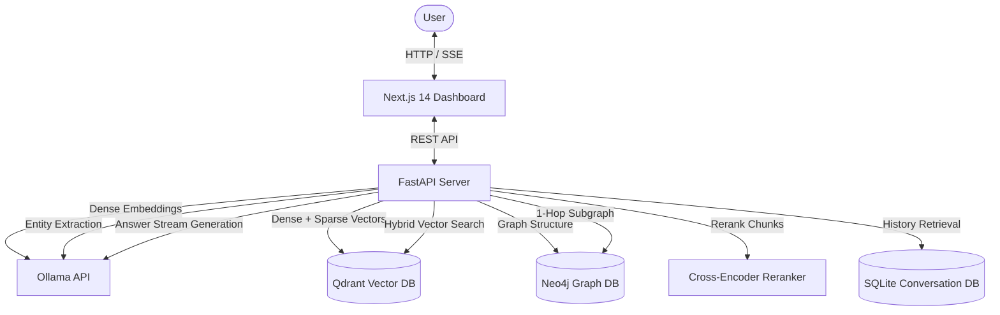

# I.N.A.Y.A.T. — Intelligent Neural Architecture for Yielding Agentic Thinking

A fully local AI Knowledge Intelligence System showcasing Graph RAG, Semantic Hybrid Search, Citation-based QA, and Interactive Subgraph Visualization.

Designed to run completely offline on local consumer hardware (optimized for RTX 3050 4GB VRAM, 16GB RAM, i5-10500H).

---

## Key Features

- **Graph RAG**: Leverages Neo4j 5 for graph traversal context combined with Qdrant vector context.
- **Hybrid Semantic Search**: Combines dense (768-dimensional `nomic-embed-text:v1.5`) and sparse (BM25) vector indexes with Reciprocal Rank Fusion (RRF).
- **CPU-Only Reranking**: Uses sentence-transformers Cross-Encoder (`ms-marco-MiniLM-L-6-v2`) on CPU to re-rank results without taking up GPU VRAM.
- **Persistent Conversation Memory**: Isolated session history stored using aiosqlite (SQLite).
- **Interactive Knowledge Graph**: Beautiful Next.js frontend with Three.js mesh and 2D force-directed canvas.
- **Strict VRAM Safeguards**: Configured for 4GB VRAM limits (Ollama flash attention, quantized KV cache, token limit caps, `/no_think` disabling CoT, and `keep_alive: 0` for background uploads).

---

## Technology Stack

- **Frontend**: Next.js 14, React, Tailwind CSS, Shadcn UI, Framer Motion, Three.js, react-force-graph-2d
- **Backend**: Python 3.11, FastAPI, Uvicorn, aiosqlite, PyPDF2, python-docx
- **Vector DB**: Qdrant (Docker Container)
- **Graph DB**: Neo4j 5 (Docker Container)
- **Local Models**: Ollama (`qwen3:4b` + `nomic-embed-text:v1.5`), Cross-Encoder (`ms-marco-MiniLM-L-6-v2` via sentence-transformers)

---

## System Architecture



---

## Quick Start

### 1. Ingest Ollama Models
Set up your Ollama environment variables and pull the necessary models:
```bash
ollama pull nomic-embed-text:v1.5
ollama pull qwen3:4b
```

### 2. Launch Docker Services & Dev Servers
Run the automated script to boot the databases, FastAPI backend, and Next.js frontend:
```bash
# Windows (PowerShell)
.\scripts\start_dev.sh
```

For full installation and troubleshooting steps, refer to [SETUP.md](file:///c:/Users/moham/Music/INAYAT%20MCA%20LNCT%20MAJOR%20PROJECT/SETUP.md).

For step-by-step verification and manual testing instructions, see [TESTING.md](file:///c:/Users/moham/Music/INAYAT%20MCA%20LNCT%20MAJOR%20PROJECT/TESTING.md).
