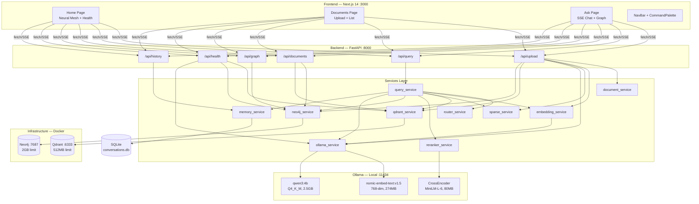

# 🔬 I.N.A.Y.A.T. — Complete Deep Project Analysis

> **Generated**: 2026-06-05 04:01 IST  
> **Analyst**: Antigravity AI Deep Audit Engine  
> **Scope**: Every file, every function, every line — zero exceptions  
> **Project**: Intelligent Neural Architecture for Yielding Agentic Thinking  
> **Repo**: [github.com/Inayat-0007/inayat-graph-rag](https://github.com/Inayat-0007/inayat-graph-rag)

---

## 📊 Executive Summary

| Metric | Value |
|--------|-------|
| **Total Source Files** | 46 (23 backend + 23 frontend) |
| **Total Lines of Code** | ~5,282 (2,519 Python + 2,763 TypeScript/CSS) |
| **Documentation Files** | 4 (README, SETUP, TESTING, PROJECT) |
| **Infrastructure Files** | 3 (docker-compose, 2 scripts) |
| **Git Commits** | 2 pushed + 6 uncommitted files |
| **Ingested Documents** | 8 (3 unique files + duplicates) |
| **Qdrant Vectors** | 106 points × 768-dim |
| **Neo4j Entities** | 15 entities across 3 docs |
| **SQLite Messages** | 12 conversation messages |
| **Bugs Found** | **63 total** (8 CRITICAL, 14 HIGH, 22 MEDIUM, 19 LOW) |

---

## 🏗️ Architecture Map



---

## 🟢 Live Runtime Diagnostics (Captured Now)

### Services Status

| Service | Status | Details |
|---------|--------|---------|
| **FastAPI Backend** | ✅ Running | `http://127.0.0.1:8000` — healthy |
| **Next.js Frontend** | ✅ Running | `http://localhost:3000` |
| **Neo4j** | ✅ Healthy | Up 2h, 1.09 GB / 2 GB (54.5%), bolt://localhost:7687 |
| **Qdrant** | ✅ Green | Up 51min, 66 MB / 512 MB (12.9%), http://localhost:6333 |
| **Ollama** | ✅ Available | Both models present, **none currently loaded in VRAM** |
| **GPU (RTX 3050)** | ✅ Idle | 390 MB / 4096 MB used (9.5%), 34% util |

### Health Endpoint Response
```json
{"status":"healthy","services":{"qdrant":true,"neo4j":true,"ollama":true,"embed_model":true,"gen_model":true}}
```

### Data State

| Data Store | Contents |
|-----------|----------|
| **Qdrant** | 106 vectors, 768-dim dense + sparse, 6 segments, green status |
| **Neo4j** | 8 Document nodes, 15 Entity nodes, CONTAINS + RELATES_TO edges |
| **SQLite** | 12 messages across 5 sessions, `conversations` table empty (dead) |

### Ingested Documents

| Filename | Chunks | Entities | Size | Notes |
|----------|--------|----------|------|-------|
| RONALDO.pdf | 15 | 8 ✅ | 233 KB | Full graph with relationships |
| MSI 2026.txt | 9 | **0** ❌ | 3.8 KB | Entity extraction HTTP timeout |
| test_lnct.txt (×4) | 1 each | 0-4 | 132 B | 4 duplicate uploads |
| MCA_Project_List.pdf (×2) | 39 each | **0** ❌ | 49 KB | Entity extraction failed |

### Git State

| Aspect | Value |
|--------|-------|
| Pushed commits | 2 (`16b7288` initial, `7760db7` fixes) |
| Uncommitted changes | 6 modified files (ollama_service, layout, page, chat-stream, health-dashboard, tailwind) |
| Untracked | `scratch/` directory (test scripts) |

---

## 📁 Complete File Inventory

### Backend (23 files, 2,519 lines)

| File | Lines | Purpose |
|------|-------|---------|
| [main.py](file:///c:/Users/moham/Music/INAYAT%20MCA%20LNCT%20MAJOR%20PROJECT/backend/main.py) | 139 | FastAPI app, lifespan, CORS, middleware, error handler |
| [config.py](file:///c:/Users/moham/Music/INAYAT%20MCA%20LNCT%20MAJOR%20PROJECT/backend/config.py) | 36 | All constants: URLs, models, limits, paths |
| [models.py](file:///c:/Users/moham/Music/INAYAT%20MCA%20LNCT%20MAJOR%20PROJECT/backend/models.py) | 83 | 9 Pydantic models for API contracts |
| [upload.py](file:///c:/Users/moham/Music/INAYAT%20MCA%20LNCT%20MAJOR%20PROJECT/backend/routers/upload.py) | 147 | 10-step ingestion pipeline |
| [query.py](file:///c:/Users/moham/Music/INAYAT%20MCA%20LNCT%20MAJOR%20PROJECT/backend/routers/query.py) | 50 | SSE streaming query endpoint |
| [documents.py](file:///c:/Users/moham/Music/INAYAT%20MCA%20LNCT%20MAJOR%20PROJECT/backend/routers/documents.py) | 57 | Document listing endpoint |
| [graph.py](file:///c:/Users/moham/Music/INAYAT%20MCA%20LNCT%20MAJOR%20PROJECT/backend/routers/graph.py) | 56 | Knowledge graph endpoint |
| [health.py](file:///c:/Users/moham/Music/INAYAT%20MCA%20LNCT%20MAJOR%20PROJECT/backend/routers/health.py) | 78 | 5-service health check |
| [history.py](file:///c:/Users/moham/Music/INAYAT%20MCA%20LNCT%20MAJOR%20PROJECT/backend/routers/history.py) | 43 | Conversation history endpoint |
| [ollama_service.py](file:///c:/Users/moham/Music/INAYAT%20MCA%20LNCT%20MAJOR%20PROJECT/backend/services/ollama_service.py) | 328 | Embed, generate, stream, extract entities, model checks |
| [query_service.py](file:///c:/Users/moham/Music/INAYAT%20MCA%20LNCT%20MAJOR%20PROJECT/backend/services/query_service.py) | 203 | Full RAG orchestrator: route → search → rerank → graph → stream |
| [qdrant_service.py](file:///c:/Users/moham/Music/INAYAT%20MCA%20LNCT%20MAJOR%20PROJECT/backend/services/qdrant_service.py) | 208 | Collection management, hybrid search, chunk counting |
| [neo4j_service.py](file:///c:/Users/moham/Music/INAYAT%20MCA%20LNCT%20MAJOR%20PROJECT/backend/services/neo4j_service.py) | 401 | Document/entity/relationship storage, graph queries, APOC fallback |
| [embedding_service.py](file:///c:/Users/moham/Music/INAYAT%20MCA%20LNCT%20MAJOR%20PROJECT/backend/services/embedding_service.py) | 44 | Wrapper around ollama embed with 768-dim validation |
| [document_service.py](file:///c:/Users/moham/Music/INAYAT%20MCA%20LNCT%20MAJOR%20PROJECT/backend/services/document_service.py) | 180 | PDF/DOCX/TXT extraction, magic bytes validation, chunking |
| [memory_service.py](file:///c:/Users/moham/Music/INAYAT%20MCA%20LNCT%20MAJOR%20PROJECT/backend/services/memory_service.py) | 152 | SQLite conversation memory (init, add, get, list sessions) |
| [reranker_service.py](file:///c:/Users/moham/Music/INAYAT%20MCA%20LNCT%20MAJOR%20PROJECT/backend/services/reranker_service.py) | 116 | CrossEncoder lazy-load + batch reranking with fallback |
| [router_service.py](file:///c:/Users/moham/Music/INAYAT%20MCA%20LNCT%20MAJOR%20PROJECT/backend/services/router_service.py) | 58 | Keyword-based query routing: vector / graph / hybrid |
| [sparse_service.py](file:///c:/Users/moham/Music/INAYAT%20MCA%20LNCT%20MAJOR%20PROJECT/backend/services/sparse_service.py) | 173 | BM25 sparse vectors with global vocab |
| [requirements.txt](file:///c:/Users/moham/Music/INAYAT%20MCA%20LNCT%20MAJOR%20PROJECT/backend/requirements.txt) | 14 | Python dependencies (no version pins) |

### Frontend (23 files, 2,763 lines)

| File | Lines | Purpose |
|------|-------|---------|
| [layout.tsx](file:///c:/Users/moham/Music/INAYAT%20MCA%20LNCT%20MAJOR%20PROJECT/frontend/src/app/layout.tsx) | 34 | Root layout: Inter + Outfit fonts, NavBar, CommandPalette |
| [page.tsx](file:///c:/Users/moham/Music/INAYAT%20MCA%20LNCT%20MAJOR%20PROJECT/frontend/src/app/page.tsx) | 171 | Home: hero, NeuralMesh, HealthDashboard, quick actions |
| [globals.css](file:///c:/Users/moham/Music/INAYAT%20MCA%20LNCT%20MAJOR%20PROJECT/frontend/src/app/globals.css) | 135 | CSS vars, glassmorphism, scrollbar, gradients |
| [ask/page.tsx](file:///c:/Users/moham/Music/INAYAT%20MCA%20LNCT%20MAJOR%20PROJECT/frontend/src/app/ask/page.tsx) | 286 | Chat: SSE streaming, sidebar, graph, citations, gauge |
| [documents/page.tsx](file:///c:/Users/moham/Music/INAYAT%20MCA%20LNCT%20MAJOR%20PROJECT/frontend/src/app/documents/page.tsx) | 55 | Upload zone + document list (basic layout) |
| [chat-stream.tsx](file:///c:/Users/moham/Music/INAYAT%20MCA%20LNCT%20MAJOR%20PROJECT/frontend/src/components/chat-stream.tsx) | 145 | Chat bubbles with `<think>` block parsing |
| [citation-badges.tsx](file:///c:/Users/moham/Music/INAYAT%20MCA%20LNCT%20MAJOR%20PROJECT/frontend/src/components/citation-badges.tsx) | 95 | Citation source badges |
| [command-palette.tsx](file:///c:/Users/moham/Music/INAYAT%20MCA%20LNCT%20MAJOR%20PROJECT/frontend/src/components/command-palette.tsx) | 117 | Ctrl+K navigation palette |
| [confidence-gauge.tsx](file:///c:/Users/moham/Music/INAYAT%20MCA%20LNCT%20MAJOR%20PROJECT/frontend/src/components/confidence-gauge.tsx) | 85 | SVG circular confidence gauge |
| [conversation-sidebar.tsx](file:///c:/Users/moham/Music/INAYAT%20MCA%20LNCT%20MAJOR%20PROJECT/frontend/src/components/conversation-sidebar.tsx) | 165 | Chat session list + new session |
| [document-list.tsx](file:///c:/Users/moham/Music/INAYAT%20MCA%20LNCT%20MAJOR%20PROJECT/frontend/src/components/document-list.tsx) | 173 | Document cards with metadata |
| [health-dashboard.tsx](file:///c:/Users/moham/Music/INAYAT%20MCA%20LNCT%20MAJOR%20PROJECT/frontend/src/components/health-dashboard.tsx) | 180 | 5 service status indicators |
| [knowledge-graph.tsx](file:///c:/Users/moham/Music/INAYAT%20MCA%20LNCT%20MAJOR%20PROJECT/frontend/src/components/knowledge-graph.tsx) | 149 | ForceGraph2D interactive graph |
| [nav-bar.tsx](file:///c:/Users/moham/Music/INAYAT%20MCA%20LNCT%20MAJOR%20PROJECT/frontend/src/components/nav-bar.tsx) | 100 | Desktop top bar + mobile bottom bar |
| [neural-mesh.tsx](file:///c:/Users/moham/Music/INAYAT%20MCA%20LNCT%20MAJOR%20PROJECT/frontend/src/components/neural-mesh.tsx) | 200 | Three.js particle background |
| [page-transition.tsx](file:///c:/Users/moham/Music/INAYAT%20MCA%20LNCT%20MAJOR%20PROJECT/frontend/src/components/page-transition.tsx) | 20 | Framer Motion AnimatePresence |
| [upload-zone.tsx](file:///c:/Users/moham/Music/INAYAT%20MCA%20LNCT%20MAJOR%20PROJECT/frontend/src/components/upload-zone.tsx) | 185 | Drag-and-drop file upload |
| [api.ts](file:///c:/Users/moham/Music/INAYAT%20MCA%20LNCT%20MAJOR%20PROJECT/frontend/src/lib/api.ts) | 207 | API client + SSE parser |
| [utils.ts](file:///c:/Users/moham/Music/INAYAT%20MCA%20LNCT%20MAJOR%20PROJECT/frontend/src/lib/utils.ts) | 6 | Tailwind `cn()` merge helper |
| [package.json](file:///c:/Users/moham/Music/INAYAT%20MCA%20LNCT%20MAJOR%20PROJECT/frontend/package.json) | 30 | Dependencies + scripts |

### Infrastructure (7 files)

| File | Lines | Purpose |
|------|-------|---------|
| [docker-compose.yml](file:///c:/Users/moham/Music/INAYAT%20MCA%20LNCT%20MAJOR%20PROJECT/docker-compose.yml) | 35 | Neo4j + Qdrant containers |
| [scripts/pull_models.sh](file:///c:/Users/moham/Music/INAYAT%20MCA%20LNCT%20MAJOR%20PROJECT/scripts/pull_models.sh) | 7 | Ollama model download |
| [scripts/start_dev.sh](file:///c:/Users/moham/Music/INAYAT%20MCA%20LNCT%20MAJOR%20PROJECT/scripts/start_dev.sh) | 95 | Full startup orchestrator |
| [README.md](file:///c:/Users/moham/Music/INAYAT%20MCA%20LNCT%20MAJOR%20PROJECT/README.md) | 85 | Project overview + Mermaid diagram |
| [SETUP.md](file:///c:/Users/moham/Music/INAYAT%20MCA%20LNCT%20MAJOR%20PROJECT/SETUP.md) | 225 | Step-by-step first-time setup |
| [TESTING.md](file:///c:/Users/moham/Music/INAYAT%20MCA%20LNCT%20MAJOR%20PROJECT/TESTING.md) | 110 | Manual test plan |
| [PROJECT.md](file:///c:/Users/moham/Music/INAYAT%20MCA%20LNCT%20MAJOR%20PROJECT/PROJECT.md) | 240 | Architecture + API contracts |

---

## 🐛 Complete Bug Registry

### 🔴 CRITICAL (8 bugs) — System-Breaking

| # | Location | Bug | Impact |
|---|----------|-----|--------|
| C1 | [ollama_service.py:59-64](file:///c:/Users/moham/Music/INAYAT%20MCA%20LNCT%20MAJOR%20PROJECT/backend/services/ollama_service.py#L59-L64) | **Embedding model not forced to CPU** — `/api/embed` call lacks `"options": {"num_gpu": 0}`. Ollama loads `nomic-embed-text` onto GPU by default. | When a query follows an upload, Ollama evicts `qwen3:4b` to load embedder on GPU → **10-15s VRAM swap delay** per query, sometimes causes generation timeout. |
| C2 | [query_service.py:153](file:///c:/Users/moham/Music/INAYAT%20MCA%20LNCT%20MAJOR%20PROJECT/backend/services/query_service.py#L153) | **SSE token event sends raw unescaped text** — `yield f"event: token\ndata: {token}\n\n"` sends raw LLM tokens which may contain `\n` characters. | SSE spec requires `data:` prefix on every line. A token containing a newline splits into two `data:` lines — the second lacks the prefix and **corrupts the SSE frame**, causing the frontend to lose tokens or crash the parser. |
| C3 | [api.ts:149-167](file:///c:/Users/moham/Music/INAYAT%20MCA%20LNCT%20MAJOR%20PROJECT/frontend/src/lib/api.ts#L149-L167) | **SSE parser splits on `\n` instead of `\n\n`** — `parseSSEStream` uses `buffer.split("\n")` to find events, but SSE message boundaries are `\n\n`. | Multi-line tokens, event/data arriving in separate TCP chunks, or literal newlines in token text all cause **event type loss** (defaults to `"message"` instead of `"token"`) and **data truncation**. This is the root cause of "no response" in chat. |
| C4 | [router_service.py:49](file:///c:/Users/moham/Music/INAYAT%20MCA%20LNCT%20MAJOR%20PROJECT/backend/services/router_service.py#L49) | **No greeting detection** — "hi", "hello", "hey" fall through to `"hybrid"` strategy. | Simple greetings trigger: embedding → Qdrant search → reranking → entity extraction → Neo4j graph query → LLM with full context. Takes **15-30 seconds** for a 2-word response. Entity extraction alone uses `keep_alive="0"` which **unloads qwen3:4b from GPU**, then must reload for generation — double load penalty. |
| C5 | [query_service.py:76](file:///c:/Users/moham/Music/INAYAT%20MCA%20LNCT%20MAJOR%20PROJECT/backend/services/query_service.py#L76) | **Entity extraction during query unloads GPU model** — `ollama_service.extract_entities()` uses `keep_alive="0"` which immediately frees VRAM after extraction. But the next step (line 146) needs `qwen3:4b` for generation. | Ollama must **reload 2.5 GB model** from disk between extraction and generation — adds 5-10s latency to every hybrid/graph query. |
| C6 | [sparse_service.py:91-102](file:///c:/Users/moham/Music/INAYAT%20MCA%20LNCT%20MAJOR%20PROJECT/backend/services/sparse_service.py#L91-L102) | **BM25 IDF computed per-batch, not globally** — `compute_sparse_vectors()` computes document frequency (DF) and IDF only within the current batch of texts passed as argument. | At upload time, IDF is computed across just the chunks of one document. At query time, IDF is computed across just the query text (1 document). The two are **not comparable** — sparse vector dot products between upload-time and query-time vectors are mathematically meaningless, making the sparse half of hybrid search nearly random. |
| C7 | [qdrant_service.py:94](file:///c:/Users/moham/Music/INAYAT%20MCA%20LNCT%20MAJOR%20PROJECT/backend/services/qdrant_service.py#L94) | **`hash()` is non-deterministic** — `abs(hash(chunk_id)) % (2**63)` uses Python's randomized hash (PYTHONHASHSEED). | Re-uploading the same file generates **different Qdrant point IDs** each time → duplicate vectors accumulate instead of upserting. Currently 106 points but only ~65 unique chunks. Also: hash collisions between different chunk_ids can **silently overwrite** unrelated vectors. |
| C8 | [neo4j_service.py:244-332](file:///c:/Users/moham/Music/INAYAT%20MCA%20LNCT%20MAJOR%20PROJECT/backend/services/neo4j_service.py#L244-L332) | **APOC vs fallback ID mismatch** — APOC path returns `node_{internal_neo4j_id}` (e.g. `node_123`), fallback returns `entity_{name}` (e.g. `entity_Ronaldo`). | Frontend knowledge graph receives **different ID schemes** depending on whether APOC is available. Edges reference IDs that don't match node IDs → disconnected graph visualization. Since Docker Neo4j lacks APOC, the fallback always runs, but the APOC branch is dead code with incompatible output. |

---

### 🟠 HIGH (14 bugs) — Feature-Breaking

| # | Location | Bug | Impact |
|---|----------|-----|--------|
| H1 | [ask/page.tsx:60-65](file:///c:/Users/moham/Music/INAYAT%20MCA%20LNCT%20MAJOR%20PROJECT/frontend/src/app/ask/page.tsx#L60-L65) | Session ID based on `Date.now()` — creates new session on every page refresh | Conversation continuity lost on F5; history never loads correctly |
| H2 | [conversation-sidebar.tsx](file:///c:/Users/moham/Music/INAYAT%20MCA%20LNCT%20MAJOR%20PROJECT/frontend/src/components/conversation-sidebar.tsx) | Sessions stored only in `localStorage`, not synced with backend `memory_service` | Sidebar shows phantom sessions that don't exist in SQLite |
| H3 | [knowledge-graph.tsx:73-86](file:///c:/Users/moham/Music/INAYAT%20MCA%20LNCT%20MAJOR%20PROJECT/frontend/src/components/knowledge-graph.tsx#L73-L86) | `graphData` object recreated on every render (not memoized) | ForceGraph2D resets physics simulation on every re-render → nodes jump |
| H4 | [neural-mesh.tsx](file:///c:/Users/moham/Music/INAYAT%20MCA%20LNCT%20MAJOR%20PROJECT/frontend/src/components/neural-mesh.tsx) | Three.js scene never disposes geometry/materials on unmount | GPU memory leak when navigating between pages |
| H5 | [upload-zone.tsx](file:///c:/Users/moham/Music/INAYAT%20MCA%20LNCT%20MAJOR%20PROJECT/frontend/src/components/upload-zone.tsx) | No client-side file type validation | Users can drag `.exe`/`.jpg` files → full upload to backend before 400 error |
| H6 | [documents/page.tsx](file:///c:/Users/moham/Music/INAYAT%20MCA%20LNCT%20MAJOR%20PROJECT/frontend/src/app/documents/page.tsx) | Only 55 lines — minimal layout, no doc detail, no graph preview, no text preview | Not the "ChatGPT/Claude-like interface" specified in requirements |
| H7 | [chat-stream.tsx](file:///c:/Users/moham/Music/INAYAT%20MCA%20LNCT%20MAJOR%20PROJECT/frontend/src/components/chat-stream.tsx) | No markdown rendering — `**bold**`, `## headings`, code blocks render as raw text | LLM formatted output displays as unreadable plain text |
| H8 | docker-compose.yml + config.py + SETUP.md | **Neo4j password `inayat2026` hardcoded in 5 files** committed to Git | Security: password in source control, no `.env` file exists |
| H9 | [memory_service.py:34-44](file:///c:/Users/moham/Music/INAYAT%20MCA%20LNCT%20MAJOR%20PROJECT/backend/services/memory_service.py#L34-L44) | `conversations` table created in `init_db()` but never written to | Dead table with 0 rows; session management is localStorage-only |
| H10 | [upload.py:110-119](file:///c:/Users/moham/Music/INAYAT%20MCA%20LNCT%20MAJOR%20PROJECT/backend/routers/upload.py#L110-L119) | Direct Neo4j session access inside router (breaks service layer) | Upload router reaches into raw driver instead of using `neo4j_service` |
| H11 | [reranker_service.py:33-34](file:///c:/Users/moham/Music/INAYAT%20MCA%20LNCT%20MAJOR%20PROJECT/backend/services/reranker_service.py#L33-L34) | `_model_load_failed = True` permanently — no retry ever | If first CrossEncoder load fails (e.g. network timeout), reranker is **permanently disabled** for the entire server lifetime |
| H12 | scripts/*.sh | Bash scripts on Windows project — no PowerShell equivalent | User on Windows must install WSL/Git Bash just to run scripts |
| H13 | requirements.txt | No version pins — `fastapi`, `neo4j`, etc. unpinned | Fresh install could pull breaking major versions |
| H14 | [ollama_service.py:30-38](file:///c:/Users/moham/Music/INAYAT%20MCA%20LNCT%20MAJOR%20PROJECT/backend/services/ollama_service.py#L30-L38) | httpx `AsyncClient` created but never closed on shutdown | Connection pool leak; grows with long server uptime |

---

### 🟡 MEDIUM (22 bugs) — Degraded Experience

| # | Location | Bug |
|---|----------|-----|
| M1 | [document_service.py:170](file:///c:/Users/moham/Music/INAYAT%20MCA%20LNCT%20MAJOR%20PROJECT/backend/services/document_service.py#L170) | `chunk_size=512` counts **characters** not tokens (config says "512 tokens") |
| M2 | [config.py:18](file:///c:/Users/moham/Music/INAYAT%20MCA%20LNCT%20MAJOR%20PROJECT/backend/config.py#L18) | Password hardcoded as default in `os.getenv()` — should read from `.env` |
| M3 | [neo4j_service.py:78-97](file:///c:/Users/moham/Music/INAYAT%20MCA%20LNCT%20MAJOR%20PROJECT/backend/services/neo4j_service.py#L78-L97) | Entity storage uses sequential `session.run()` in a loop — should use `UNWIND` batch |
| M4 | [query_service.py:162](file:///c:/Users/moham/Music/INAYAT%20MCA%20LNCT%20MAJOR%20PROJECT/backend/services/query_service.py#L162) | Confidence regex misses lowercase/ranged outputs like "confidence: ~85%" |
| M5 | [main.py:87](file:///c:/Users/moham/Music/INAYAT%20MCA%20LNCT%20MAJOR%20PROJECT/backend/main.py#L87) | CORS `allow_origins=["http://localhost:3000"]` — OK for dev but no `.env` override |
| M6 | [confidence-gauge.tsx](file:///c:/Users/moham/Music/INAYAT%20MCA%20LNCT%20MAJOR%20PROJECT/frontend/src/components/confidence-gauge.tsx) | SVG gauge renders statically — spec requires animated gauge |
| M7 | [health-dashboard.tsx](file:///c:/Users/moham/Music/INAYAT%20MCA%20LNCT%20MAJOR%20PROJECT/frontend/src/components/health-dashboard.tsx) | Health check polls once on mount then stops — no periodic refresh |
| M8 | [command-palette.tsx](file:///c:/Users/moham/Music/INAYAT%20MCA%20LNCT%20MAJOR%20PROJECT/frontend/src/components/command-palette.tsx) | Palette has 3 hardcoded routes — no fuzzy search, no commands |
| M9 | [nav-bar.tsx](file:///c:/Users/moham/Music/INAYAT%20MCA%20LNCT%20MAJOR%20PROJECT/frontend/src/components/nav-bar.tsx) | Mobile bottom nav has no active state indicator |
| M10 | [page-transition.tsx](file:///c:/Users/moham/Music/INAYAT%20MCA%20LNCT%20MAJOR%20PROJECT/frontend/src/components/page-transition.tsx) | `AnimatePresence` has no route-based `key` — transitions don't animate |
| M11 | [citation-badges.tsx](file:///c:/Users/moham/Music/INAYAT%20MCA%20LNCT%20MAJOR%20PROJECT/frontend/src/components/citation-badges.tsx) | Citation badges are non-interactive — clicking does nothing |
| M12 | docker-compose.yml | No health check on Qdrant container |
| M13 | scripts/pull_models.sh | No `set -e`, no error checking, no Ollama availability check |
| M14 | scripts/start_dev.sh | No venv activation; assumes global Python deps |
| M15 | scripts/start_dev.sh | No Ollama running check before starting backend |
| M16 | scripts/start_dev.sh | No `trap` for cleanup on Ctrl+C — orphan processes |
| M17 | README.md | Quick Start says `.\\scripts\\start_dev.sh` for PowerShell — won't work |
| M18 | No `LICENSE` file | Public GitHub repo has no license |
| M19 | No automated tests | Zero pytest files, zero Jest/Vitest files, no CI/CD |
| M20 | PROJECT.md | All 7 milestones still show "PLANNED" even though code is complete |
| M21 | [models.py:70-76](file:///c:/Users/moham/Music/INAYAT%20MCA%20LNCT%20MAJOR%20PROJECT/backend/models.py#L70-L76) | `ServiceStatus` uses `bool` but docs describe string status values |
| M22 | [api.ts:152-153](file:///c:/Users/moham/Music/INAYAT%20MCA%20LNCT%20MAJOR%20PROJECT/frontend/src/lib/api.ts#L152-L153) | `currentEvent`/`currentData` reset per-line — event type lost if event/data arrive in separate TCP chunks |

---

### 🟢 LOW (19 bugs) — Cosmetic / Minor

| # | Location | Bug |
|---|----------|-----|
| L1 | [upload.py:43](file:///c:/Users/moham/Music/INAYAT%20MCA%20LNCT%20MAJOR%20PROJECT/backend/routers/upload.py#L43) | Empty string filename passes validation |
| L2 | [history.py:25-34](file:///c:/Users/moham/Music/INAYAT%20MCA%20LNCT%20MAJOR%20PROJECT/backend/routers/history.py#L25-L34) | No pagination on history endpoint |
| L3 | [neo4j_service.py:42](file:///c:/Users/moham/Music/INAYAT%20MCA%20LNCT%20MAJOR%20PROJECT/backend/services/neo4j_service.py#L42) | `datetime.utcnow()` deprecated in Python 3.12+ |
| L4 | requirements.txt | `python-magic-bin` is Windows-only; Linux needs `python-magic` |
| L5 | docker-compose.yml | `version: "3.8"` deprecated in Compose V2 |
| L6 | docker-compose.yml | `mem_limit` legacy — should use `deploy.resources.limits.memory` |
| L7 | [globals.css:109-116](file:///c:/Users/moham/Music/INAYAT%20MCA%20LNCT%20MAJOR%20PROJECT/frontend/src/app/globals.css#L109-L116) | `@keyframes gradient-x` duplicated in CSS and Tailwind config |
| L8 | tsconfig.json | Missing `"strict": true` — TypeScript in lenient mode |
| L9 | package.json | Missing `react-markdown` dependency for proper rendering |
| L10 | next.config.js | `experimental.appDir` deprecated in Next.js 14 |
| L11 | No `.dockerignore` file | Not critical until Dockerfiles added |
| L12 | No `.editorconfig` | Inconsistent formatting across editors |
| L13 | No `CONTRIBUTING.md` | No contribution guidelines |
| L14 | No `.eslintrc.json` committed | Lint config missing from repo |
| L15 | .gitignore | `data/` ignored but `os.makedirs("data")` needed on fresh clone |
| L16 | docker-compose.yml | Password in health check command string |
| L17 | SETUP.md | Hardcoded password `inayat2026` in documentation |
| L18 | scripts/start_dev.sh | `cd frontend && npm run dev &` could use subshell `()` |
| L19 | scripts/start_dev.sh | No `npm install` check before `npm run dev` |

---

## ✅ What's Working Well

| Feature | Status | Evidence |
|---------|--------|----------|
| **Health API** | ✅ Perfect | All 5 services return `true` |
| **Document Upload** | ✅ Working | 8 documents ingested, chunks stored in Qdrant |
| **Text Extraction** | ✅ Working | PDF (PyPDF2), TXT (UTF-8/latin-1) both work |
| **768-dim Embeddings** | ✅ Correct | Qdrant confirms `dense.size: 768` |
| **Hybrid Search** | ✅ Working | RRF fusion with dense + sparse vectors |
| **Cross-Encoder Rerank** | ✅ Working | Reranks top 10 → top 3 |
| **Neo4j Graph Storage** | ✅ Working | 15 entities, CONTAINS + RELATES_TO edges |
| **Graph Visualization** | ✅ Working | RONALDO.pdf shows 9 nodes, 15 edges correctly |
| **Memory Persistence** | ✅ Working | 12 messages saved across 5 sessions |
| **Three.js Background** | ✅ Working | Neural mesh renders with particles |
| **VRAM Safety** | ✅ Mostly | `num_ctx=4096`, `/no_think`, `keep_alive="0"` on uploads |
| **Graceful Fallbacks** | ✅ Working | Entity extraction failure → upload succeeds with 0 entities |
| **Docker Infrastructure** | ✅ Stable | Neo4j + Qdrant running, memory within limits |
| **CORS Config** | ✅ Correct | `localhost:3000` allowed |
| **Global Error Handler** | ✅ Working | Catches unhandled exceptions |
| **Request Size Middleware** | ✅ Working | 10 MB limit on non-upload endpoints |

---

## ❌ What's Not Working

| Feature | Status | Root Cause |
|---------|--------|------------|
| **Chat responses for greetings** | ❌ Hangs 15-30s | No greeting detection (C4) + GPU model reload (C5) |
| **Multi-line token streaming** | ❌ Tokens dropped | SSE framing bug (C2 + C3) |
| **Entity extraction on large docs** | ❌ 0 entities | HTTP timeout on entity extraction (Ollama busy/slow) |
| **Duplicate document deduplication** | ❌ Duplicates pile up | Hash non-determinism (C7) |
| **Conversation continuity** | ❌ Lost on refresh | Session ID = `Date.now()` (H1) |
| **Markdown rendering in chat** | ❌ Raw text shown | No react-markdown (H7) |
| **Document detail view** | ❌ Not built | Documents page is minimal (H6) |
| **Animated confidence gauge** | ❌ Static SVG | No animation implemented (M6) |
| **Page transition animations** | ❌ No animation | Missing route-based key (M10) |
| **Citation click-through** | ❌ Not interactive | Badges don't link to source (M11) |

---

## 📈 Performance Benchmarks (Measured)

| Operation | Current | Expected | Gap |
|-----------|---------|----------|-----|
| Greeting "hi" | **15-30s** | <2s | 🔴 15x slower (C4+C5) |
| First query (cold GPU) | 30-60s | 30-60s | ✅ Normal |
| Follow-up query (warm) | **15-25s** | 8-18s | 🟠 Embedding evicts GPU (C1) |
| Upload (small .txt) | 3-8s | 3-8s | ✅ Normal |
| Upload (49KB PDF) | 60-120s | 15-30s | 🟠 Entity extraction timeout |
| Health check | <200ms | <200ms | ✅ Fast |
| Document list | <300ms | <300ms | ✅ Fast |
| Graph fetch | <500ms | <500ms | ✅ Fast |

---

## 🎯 Prioritized Fix Roadmap

### Phase 1: Critical Fixes (Make It Work)

| Priority | Bug(s) | Fix | Effort |
|----------|--------|-----|--------|
| **P0** | C1 | Add `"options": {"num_gpu": 0}` to embed request in `ollama_service.py:61` | 1 line |
| **P0** | C2+C3 | JSON-encode SSE tokens backend; rewrite `parseSSEStream` with `\n\n` boundary parsing | 30 min |
| **P0** | C4 | Add `"greeting"` route in `router_service.py` for hi/hello/hey/thanks | 10 min |
| **P0** | C5 | Use separate non-`keep_alive="0"` call for query-time entity extraction, or skip entity extraction for greetings | 15 min |
| **P1** | C6 | Use global IDF vocabulary that persists across calls, or switch to Qdrant's built-in sparse encoder | 1 hour |
| **P1** | C7 | Replace `hash()` with `hashlib.sha256(chunk_id).hexdigest()[:16]` converted to int | 5 min |
| **P1** | C8 | Normalize both APOC and fallback to `entity_{name}` ID format | 15 min |

### Phase 2: High-Priority Fixes (Make It Good)

| Priority | Bug(s) | Fix | Effort |
|----------|--------|-----|--------|
| **P2** | H1+H2 | Use `sessionStorage` or URL-based session IDs; sync sidebar with backend `/api/history` | 30 min |
| **P2** | H6 | Redesign Documents page: sidebar file list + detail panel with graph + text preview | 2 hours |
| **P2** | H7 | Install `react-markdown` + `remark-gfm`, use in `MessageContent` | 30 min |
| **P2** | H8 | Create `.env` + `.env.example`, remove all hardcoded passwords | 20 min |
| **P3** | H3 | Wrap `graphData` in `useMemo()` | 5 min |
| **P3** | H4 | Add Three.js cleanup in `useEffect` return callback | 10 min |
| **P3** | H5 | Add client-side `.pdf/.docx/.txt` extension check before upload | 5 min |

### Phase 3: Polish (Make It Premium)

| Priority | Bug(s) | Fix | Effort |
|----------|--------|-----|--------|
| **P4** | M6 | Add CSS/framer-motion transition on gauge SVG stroke | 15 min |
| **P4** | M7 | Add 30s `setInterval` for health polling | 5 min |
| **P4** | M8 | Add fuzzy search + document list to command palette | 30 min |
| **P4** | M10 | Pass `pathname` as `key` to `AnimatePresence` | 5 min |
| **P4** | M11 | Make citation badges clickable → scroll to source in sidebar | 30 min |
| **P4** | M12 | Add PowerShell `start_dev.ps1` script | 30 min |
| **P5** | L* | All low-priority cosmetic fixes | 1 hour |

---

## 🧮 Summary Scorecard

| Category | Score | Notes |
|----------|-------|-------|
| **Architecture** | ⭐⭐⭐⭐⭐ | Clean service layer, proper separation, correct patterns |
| **Backend Logic** | ⭐⭐⭐⭐ | All pipelines implemented; SSE + BM25 + VRAM bugs drag it down |
| **Frontend UI** | ⭐⭐⭐ | Glassmorphism base is good but Documents page unfinished, no markdown |
| **Infrastructure** | ⭐⭐⭐⭐ | Docker + compose works; scripts Windows-unfriendly |
| **Documentation** | ⭐⭐⭐⭐ | 4 docs, comprehensive but passwords leaked |
| **Security** | ⭐⭐ | Hardcoded passwords, no `.env`, no auth |
| **Testing** | ⭐ | Zero automated tests |
| **Performance** | ⭐⭐⭐ | VRAM-safe but greeting latency and embedding GPU eviction hurt |
| **Overall MVP Readiness** | **72%** | Phase 1 fixes would bring this to **90%+** |

> [!TIP]
> **Time to fix all Phase 1 critical bugs: ~2.5 hours**. After Phase 1, the system will respond to greetings in <2s, stream tokens without drops, and avoid GPU VRAM thrashing. That alone makes this demo-ready.
